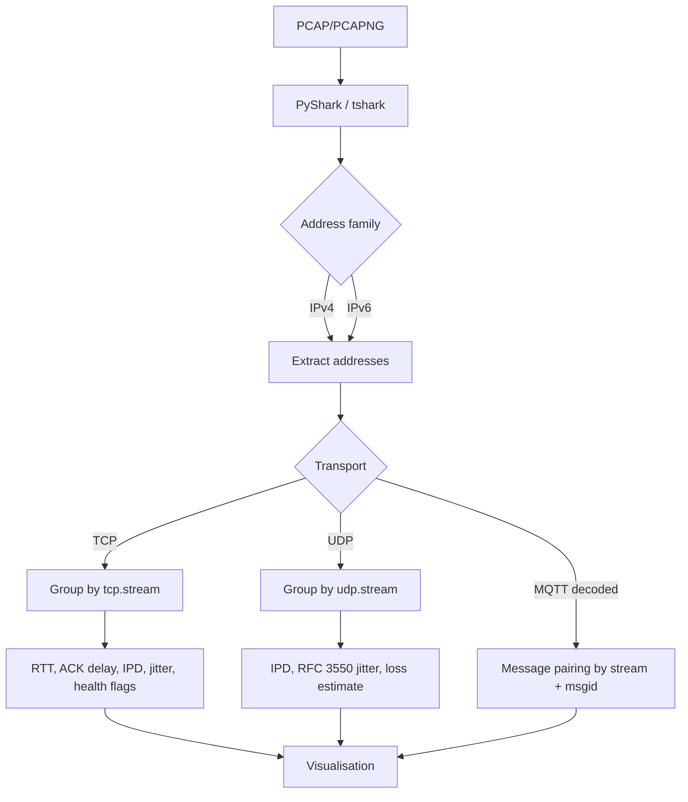

# StreamSight

## Network Packet Analysis and Delay Characterization Tool

StreamSight analyses `.pcap` / `.pcapng` captures and characterises transmission delay across
TCP, UDP and MQTT, with a focus on attributing delay to a cause rather than only measuring it.

**Team Rocket:**
- Jayant Choudhary [2023A7PS0404G]
- Swayam Lakhotia [2023A7PS0368G]
- Siddhant Kedia [2023A7PS0375G]
- Pratham Chheda [2023AAPS0138G]

## Table of Contents
1. [Features](#features)
2. [Installation](#installation)
3. [Usage](#usage)
4. [Core Logic](#core-logic)
5. [Metrics](#metrics)
6. [File Structure](#file-structure)
7. [Testing](#testing)

## Features

- TCP delay analysis: RTT, ACK delay, inter-packet delay, jitter, retransmission delay
- TCP health signals: zero-window, window-full, duplicate ACK, out-of-order, spurious retransmission
- UDP analysis: inter-packet delay, RFC 3550 jitter, loss estimation, congestion scoring
- MQTT delay decomposition for unencrypted (QoS 1) traffic
- IPv4 and IPv6 support
- Root-cause correlation of delay against packet size, protocol and endpoints
- Interactive Streamlit frontend with CSV export
- Synthetic traffic generation, so the app is fully usable with no capture file

## Installation

1. Clone the repository:
```
git clone https://github.com/yourusername/StreamSight.git
cd StreamSight
```

2. Install dependencies:
```
pip install -r requirements.txt
```

3. Install Wireshark — StreamSight uses its `tshark` binary via PyShark:
   [Wireshark Download](https://www.wireshark.org/download.html)

   **`tshark` must be on your `PATH`, not merely installed.** On Windows that usually means
   adding `C:\Program Files\Wireshark` to `PATH` and restarting your terminal. Verify with:
```
tshark --version
```

## Usage

```
streamlit run app.py
```

Upload a `.pcap`/`.pcapng` file, or use the generated demo data that loads by default.

Parsing is cached on the file's contents, so filtering and navigating tabs do not re-parse
the capture. The first parse of a large file can take several minutes — PyShark is the
bottleneck, not the analysis.

## Core Logic

### Packet Processing Pipeline (`pcap_parser.py`)



### Capture readers

Two interchangeable backends produce identical frames:

| Backend | How it works |
|---|---|
| `tshark` (default) | Drives `tshark -T fields` directly and parses tab-separated text |
| `pyshark` | PyShark's default path, which deserialises tshark's full PDML (XML) |

The fast reader asks tshark for exactly the ~34 fields StreamSight uses, avoiding both the
generation and the parsing of XML for everything else. On a 13 MB / 48,000-packet capture
this is the difference between **2.9 s and 171 s** — roughly 58x — for byte-identical output.

`parse_pcap` selects it automatically and falls back to PyShark if tshark cannot be driven
directly:

```python
parse_pcap(path)                     # auto: fast reader, PyShark fallback
parse_pcap(path, backend="tshark")   # force the fast reader
parse_pcap(path, backend="pyshark")  # force PyShark
```

`tests/test_backends.py` asserts the two agree field by field on real captures.

Note `use_json=True` was evaluated for PyShark and **rejected**: it silently drops
`tcp.flags.ack`, which would make every ACK read as unset and disable RTT and ACK-delay
pairing entirely.

### Connection grouping

Connections are keyed on tshark's **stream index** (`tcp.stream` / `udp.stream`), which is
bidirectional. This matters: keying on an endpoint string such as `src:sport-dst:dport`
places `A→B` and `B→A` in separate buckets, and RTT and ACK delay are inherently
bidirectional measurements — they cannot be computed if the two directions never meet.

### Units

`frame_info.time_epoch` is reported in **seconds**. Every duration is converted to
**milliseconds** at the point it is computed (see `units.py`). Absolute timestamps stay in
epoch seconds so they can be passed to `pd.to_datetime(..., unit='s')`.

### MQTT and port 8883

Port 8883 is MQTT over TLS. The payload is encrypted, so message types, message IDs and QoS
are **not observable**. StreamSight labels this traffic `MQTT/TLS` and analyses it on the TCP
path, reporting what genuinely can be measured — RTT, retransmissions, window events and
throughput. It is not given fabricated message IDs or payload-level delays.

Unencrypted MQTT (typically port 1883) is decoded properly. Note that MQTT **QoS 0 sends no
PUBACK**, so a PUBLISH cannot be paired with an acknowledgement and no end-to-end delay can
be derived from a QoS-0-only capture. StreamSight reports this explicitly rather than showing
an empty table. QoS 0 publishes also carry no `mqtt.msgid`, so messages are keyed on
`(stream, frame)` to keep them distinct.

## Metrics

### TCP
| Metric | Source |
|---|---|
| RTT | `tcp.analysis.ack_rtt` per acknowledged segment, falling back to the handshake |
| Handshake RTT | SYN → SYN/ACK, one per connection |
| ACK delay | Data segment → peer's acknowledgement, matched cumulatively |
| Inter-packet delay | Gap between consecutive packets on a stream |
| Jitter | Variation in inter-packet delay |
| Retransmission delay | Gap back to the first transmission of the same sequence |
| Health flags | zero-window, window-full, duplicate ACK, out-of-order, spurious retransmission |
| Throughput | Payload bits per second, per connection |
| TLS handshake duration | First to last TLS handshake record — connection setup cost |

Retransmission is counted as a **set membership** across tshark's retransmission fields.
tshark flags fast and spurious retransmissions as plain retransmissions too, so adding the
individual counts double-counts the same packets.

### UDP
| Metric | Notes |
|---|---|
| Inter-packet delay | Gap between consecutive packets on a flow |
| Jitter | RFC 3550 EMA, seeded at 0 |
| Loss estimate | RTP sequence gaps when available (wraparound-aware); timing gaps only as a fallback |
| Congestion score | Combined jitter ratio and loss estimate |

Flows shorter than 5 packets are **flagged, not measured**. Request/response traffic such as
DNS and mDNS arrives in two-packet exchanges, and a jitter or loss figure derived from two
samples is noise, not a measurement.

Multicast flows (IPv4 `224.0.0.0/4`, IPv6 `ff00::/8`) are labelled as such. They are one-way
to a group address rather than two-way conversations, so round-trip metrics do not apply.

**Loss is observed, not guessed, wherever possible.** When at least 80% of a flow's packets
carry a sequence number, those are the authority and the timing heuristic is not used at all.
The timing fallback assumes a roughly constant packet rate, so it only runs when a flow's
median IPD is at least half its mean, and its per-gap result is capped.

Without those guards the heuristic fabricates: on a real 49-packet H.263-over-RTP capture,
fragmented video frames arriving back-to-back gave a median IPD of 0.016 ms, and one 324 ms
idle gap divided by it was reported as **20,137 lost packets**. The sequence numbers in the
same capture show zero loss.

### MQTT
Device→Broker delay, broker processing delay, cloud upload delay, and the dominant
contributor ("bottleneck") per message. Requires QoS 1 (see above).

## File Structure

```
StreamSight/
├── app.py                  # Streamlit application entry point
├── pcap_parser.py          # Packet processing and per-protocol metrics
├── analysis.py             # Categorisation, anomaly detection, root-cause wiring
├── rootcause_analysis.py   # Delay correlation engine
├── visualizations.py       # Plotly chart builders
├── data_generator.py       # Synthetic traffic for demo mode and tests
├── units.py                # Second→millisecond conversion
├── requirements.txt
├── proposal.pdf
├── tabs/                   # UI components
│   ├── overview.py
│   ├── tcp_analysis.py
│   ├── udp_analysis.py
│   ├── mqtt_analysis.py
│   ├── delay_analysis.py
│   ├── insights.py
│   ├── timeline.py
│   ├── search.py
│   ├── explorer.py
│   └── rootcause_tab.py
└── tests/
    ├── conftest.py
    ├── test_tcp_metrics.py
    ├── test_analysis.py
    ├── test_parsing.py
    └── fixtures/           # Small captures used as regression fixtures
```

## Testing

```
pytest tests/ -v
```

The suite covers the metric computations, the binning and statistics helpers, and end-to-end
parsing against two small bundled captures. Tests needing `tshark` skip automatically when it
is not on `PATH`.

A second suite cross-checks a full 13 MB capture against `tshark` ground truth (connection
count, retransmissions, zero-window events). It is skipped by default because it takes
minutes and the capture is too large to version:

```
pytest tests/test_large_capture.py --run-slow
```

`tests/fixtures/mqtt_delays.pcapng` is an IPv6 loopback (`::1`) capture and serves as the
regression guard for IPv6 address extraction; `mqtt_packets.pcapng` is IPv4 QoS 0 and guards
message-key generation.

### Edge cases covered
- Right-skewed and perfectly uniform delay distributions (both break naive `pd.cut` bins)
- All-NaN metric columns
- Negative time differences (a broker forwarding before it acknowledges)
- Two-packet UDP flows too short to measure
- RTP sequence-number wraparound at 65535
- Missing MQTT delay columns when no PUBLISH/PUBACK pair exists
- Parsing two captures in one session
